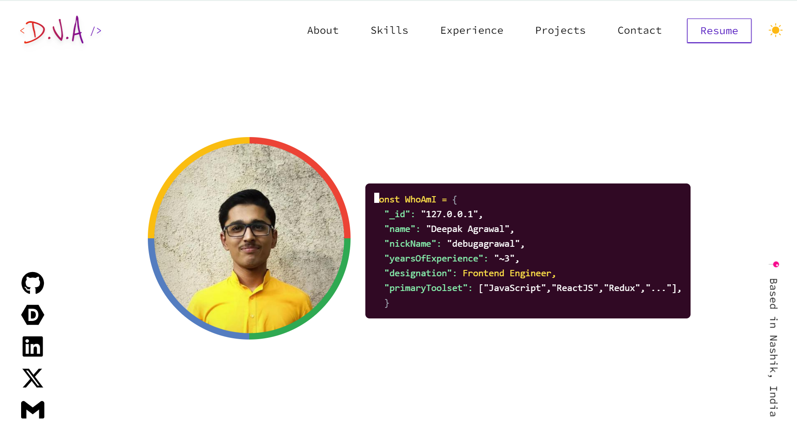

> ---
> ## 🤖Personal Portfolio. 
> ---
> 
> ---
> #### 🧪 Built Using :
> - ReactJs
> - TailwindCSS
> - Vite
> ---
> #### 🤺Some major Features:
>- Supports theme toggle
> - Resume Section
> - Fully responsive for all viewports.
> ---
> #### 🪜 Steps to make it work on local:
> - `git clone https://github.com/DebugAgrawal/debugagrawal.github.io.git`
> - `npm i`
> - `npm run dev`
> ---

